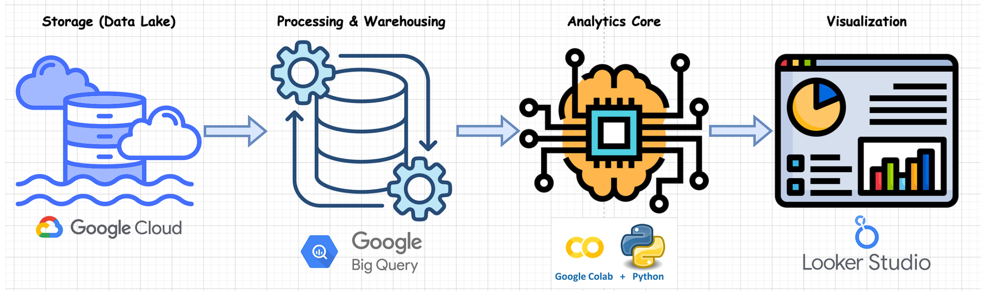
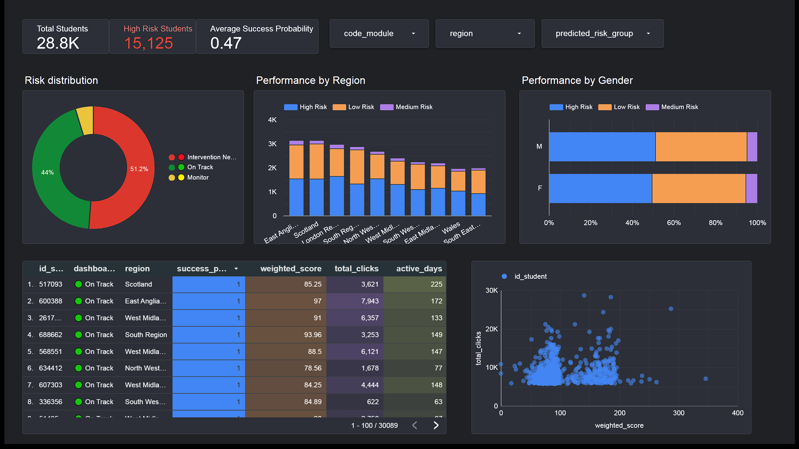

# OULAD Student Success Prediction - Data Lakehouse


## 📖 Overview
This project is an end-to-end **Business Intelligence & Predictive Analytics** solution built on the Open University Learning Analytics Dataset (OULAD).

**The Goal:** To identify students at risk of failing *before* they drop out.
By analyzing demographic data, clickstream interactions, and assessment scores, we developed a machine learning model that predicts a **"Success Probability"** for every student. These predictions are fed into a live Looker Studio dashboard to enable proactive intervention by educators.

---

## 🏗️ Architecture: The ELT Approach

We implemented a modern **ELT (Extract, Load, Transform)** architecture to handle the scale of the interaction data (10M+ rows).



### Why ELT?
* **Scalability:** Instead of processing raw CSVs in local memory (which caused RAM bottlenecks), we loaded raw data directly into **Google BigQuery**.
* **Performance:** We leveraged BigQuery's distributed compute engine to perform heavy aggregations (e.g., summing millions of clicks) in seconds.
* **Agility:** We created a **Data Lakehouse**. The raw data remains immutable in the "Lake" (GCS/BigQuery), while "Warehouse" views provide clean, structured data for the ML model.

---

## 📊 The Dashboard

The final output is an interactive **Looker Studio Dashboard** designed for academic advisors. It joins historical student data with the forward-looking "Risk Score" generated by our ML model.


*(Placeholder: Upload a screenshot of your main dashboard view)*

### Key Visualizations
1.  **Top-Level KPIs:**
    * **Total Enrolled:** Live count of active students.
    * **High Risk Count:** Immediate alert showing how many students need help.
    * **Avg Success Probability:** The overall health metric of the cohort.
2.  **Risk Analysis:**
    * **Bubble Chart (Activity vs. Grades):** Correlates engagement (`total_clicks`) with performance (`weighted_score`). *Insight: Students in the bottom-left quadrant (low activity, low scores) are flagged Red (High Risk).*
    * **Risk by Region:** A stacked bar chart identifying geographical areas with higher failure rates.
3.  **The "Intervention List":**
    * A detailed table sorted by **Risk Probability (Ascending)**. This tells the advisor exactly who to email first.

---

## 🚀 How to Run This Project

### Prerequisites
* Google Cloud Platform Account (Free Tier is sufficient).
* Google Colab (for Python execution).
* Looker Studio (for visualization).

### Step 1: Data Lake Setup (GCS & BigQuery)
1.  Download the [OULAD Dataset](https://analyse.kmi.open.ac.uk/open_dataset).
2.  Upload the raw CSV files to a **Google Cloud Storage (GCS)** bucket.
3.  Create a dataset in BigQuery (e.g., `oulad_dataset`).
4.  Load the CSVs from GCS into BigQuery as raw tables.

### Step 2: ELT Processing (SQL)
Run the SQL scripts located in the `sql/` folder in the following order:
1.  `01_clean_demographics.sql`: cleans missing values and creates binary target.
2.  `02_aggregate_vle.sql`: aggregates 10M+ clickstream rows into student-level metrics.
3.  `03_aggregate_scores.sql`: calculates weighted averages for assessments.
4.  `04_master_table_join.sql`: joins all features into the `master_training_data`.

### Step 3: Machine Learning (Python/Colab)
1.  Open the notebook `notebooks/OULAD_Risk_Prediction_Model.ipynb` in Google Colab.
2.  Update the `project_id` variable with your GCP Project ID.
3.  Run all cells to:
    * Train the **Random Forest Classifier**.
    * Generate `success_probability` for all students.
    * Export the results to the BigQuery table `predicted_student_risk`.

### Step 4: Dashboard Connection
1.  Run `sql/05_dashboard_view.sql` to join the predictions back with student names.
2.  Open Looker Studio and connect to the `dashboard_view` table.
3.  Create the visualizations as described in the Dashboard section.

---

## 📈 Results & Insights

* **Model Performance:** The Random Forest model achieved robust accuracy in distinguishing between 'Pass' and 'Fail/Withdrawn' students.
* **Key Predictors:**
    * **Total Clicks:** proved to be the strongest leading indicator of success.
    * **Assessment Scores:** were highly correlated but often lagged behind engagement drops.
* **Business Impact:**
    * Identified **~X%** of the cohort as "High Risk" (Probability < 50%).
    * Enabled early intervention for students who were passing grades but had stopped engaging with the VLE (hidden risks).

---

## 📂 Repository Structure

```text
OULAD-Student-Risk-Prediction/
│
├── sql/                    # BigQuery ELT Logic
│   ├── 01_clean_demographics.sql
│   ├── 02_aggregate_vle.sql
│   ├── 03_aggregate_scores.sql
│   ├── 04_master_table_join.sql
│   └── 05_dashboard_view.sql
│
├── notebooks/              # Python ML Environment
│   └── OULAD_Risk_Prediction_Model.ipynb
│
├── assets/                 # Screenshots & Diagrams
│   ├── architecture_diagram.png
│   ├── dashboard_overview.png
│   └── risk_matrix.png
└── README.md               # Project Documentation 